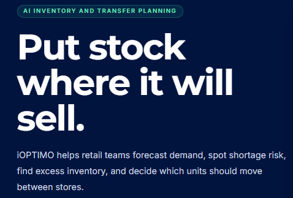

# AI-Powered Inventory Optimization for Multi-Store Retail: Forecast Demand, Reduce Stockouts, and Improve Allocation Decisions

AI-powered inventory optimization uses machine learning to forecast demand at the store and SKU level, detect shortage and excess inventory risk early, and recommend exactly which stock should be moved, reordered, or marked down before those problems impact sales and profitability.

{/* truncate */}

For multi-store retailers, it replaces spreadsheet-based inventory planning and allocation guesswork with data-driven decisions ranked by measurable business impact.

## Why Traditional Inventory Planning Breaks in Multi-Store Retail

Many retail organizations still rely on a weekly planning cycle built around spreadsheets and historical reports. Sales data is collected, planners review inventory levels manually, and transfer decisions are made days after the original demand signal appeared.

While this process may seem manageable, it creates two costly inventory problems.

### Stockouts on Best-Selling Products

A store may have strong demand for a specific item today but lack the inventory required to fulfill customer demand.

For example, one location may be completely out of a popular size-38 white linen shirt while several other stores still hold excess units. The sale is lost, and often the customer is lost as well.

### Markdowns on Slow-Moving Inventory

Excess inventory often remains trapped in locations where demand is weak. As products age, retailers eventually resort to discounts and markdowns, reducing margin that could have been protected through better allocation decisions.

Both problems share the same root cause: by the time a planner notices the trend, the cheapest opportunity to act has already passed.

## What AI Changes: From Reporting to Recommendation

Traditional dashboards tell retailers what happened. AI-powered optimization platforms tell retailers what to do next.

The difference is significant:

**“Here is your stock cover.”
versus

> “Move 12 units from Phuket to Bangkok today and prevent an expected stockout.”

Modern AI inventory optimization platforms typically operate through four key stages.

## 1. Forecast Demand Where It Actually Happens

Effective forecasting occurs at the intersection of:

- Store

- Product

- Size

- Color

Demand for the same product can vary significantly between locations. A flagship city store behaves differently from an airport outlet, resort destination, or suburban shopping center.

Seasonal products, trend-driven items, and intermittent sellers all require different forecasting approaches.

Modern AI platforms automatically select the most appropriate forecasting methodology for each SKU, eliminating the need for manual model tuning.

## 2. Detect Risk Before Stores Feel the Impact

Once accurate forecasts are available, inventory risks become predictable rather than reactive surprises.

Retail teams can identify:

- Future stockout risks

- Excess inventory positions

- Overstocked stores

- Broken size runs

- Inventory imbalance across locations

AI systems prioritize these risks using urgency scores, helping planners focus attention on the issues with the greatest financial impact.

## 3. Recommend Actions, Not Just Numbers

The most valuable output is not another report. It is a practical action plan.

AI optimization platforms generate recommendations including:

- Source store

- Destination store

- Quantity to transfer

- Priority ranking

- Expected business impact

Instead of spending hours building transfer proposals manually, planners can approve dozens of recommendations in minutes.

## 4. Learn from Every Inventory Cycle

Unlike spreadsheet processes, AI systems continuously improve.

Every sale, transfer, and inventory movement becomes additional learning data. Forecast accuracy improves over time, enabling increasingly effective allocation and replenishment decisions.

Inventory optimization becomes a repeatable process rather than a weekly exercise dependent on individual planner experience.

## What This Looks Like in Practice

This is exactly the challenge that iOPTIMO**, Integrated Retail's AI inventory and transfer optimization platform, was designed to solve.

iOPTIMO forecasts demand at the store, product, size, and color level, identifies shortage and excess inventory risks through urgency scoring, and generates transfer recommendations that planners can approve with a single click.

The platform is built on more than 20 years of retail consulting experience across Asia Pacific, where multi-store fashion, footwear, sportswear, and lifestyle retailers regularly face inventory allocation challenges.

It also works alongside the systems retailers already use.

- Retail Pro Prism

- Cegid Retail

- Other retail inventory ecosystems

These platforms provide the operational data foundation, while the AI layer transforms that data into actionable decisions.

## Where to Start

Retailers do not need a large-scale transformation project to begin benefiting from AI-powered inventory optimization.

A practical approach is to start with a single category that already experiences allocation challenges.

1. Select one product category with visible inventory allocation pain (fashion size runs are often ideal).

2. Connect existing sales, inventory, product master, and store-level data.

3. Run AI forecasts and transfer recommendations alongside your current planning process.

4. Compare results over several weeks.

5. Measure improvements in stockout rates and markdown value.

For many retailers, reducing stockouts on top-selling products and minimizing markdowns on excess inventory provides a measurable return within a short period.

## The Foundation: Real-Time Inventory Visibility

AI optimization is most effective when built on accurate, real-time inventory visibility.

If inventory accuracy and visibility remain major challenges, retailers should first establish a reliable inventory foundation before layering advanced optimization capabilities on top.

Real-time inventory visibility enables organizations to reduce stock loss, improve fulfillment accuracy, and create the data quality required for AI-driven decision making.

## Ready to See AI Inventory Optimization with Your Own Data?

Discover how AI-powered inventory optimization can help your retail business reduce stockouts, lower markdowns, improve transfer decisions, and increase inventory productivity across every store.

Schedule a 30-minute consultation with our team and see recommendations generated using your stores, your products, and your inventory data.

**See what smarter inventory decisions can do for your retail operation.**
