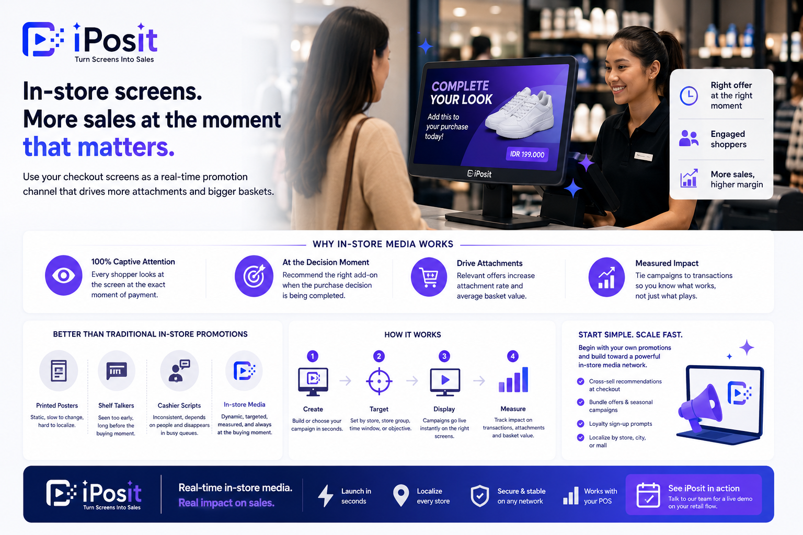

**
In-store retail media means using the screens inside your own stores — especially customer-facing displays at checkout — as a promotion channel, the same way e-commerce sites use their homepages and search results. For physical retailers it is the most under-used media asset they own: every shopper who reaches the counter looks at that screen, at the exact moment a purchase decision is being completed.

{/* truncate */}

## Why in-store media is having its moment

Retail media exploded online first: retailers realized their own digital real estate was valuable to brands and to their own promotions. The same logic is now moving into physical stores — and checkout is the natural starting point, because it is the one place in the store where attention is guaranteed. The customer is standing still, facing the counter, waiting for a payment to process.

Compare that to the traditional in-store promotion toolkit:

- Printed posters** — static, slow to change, impossible to localize per store without a print-and-ship cycle.

- **Shelf talkers** — seen mid-journey, long before the buying moment.

- **Cashier scripts** — inconsistent by nature; every staff member delivers them differently, and busy queues kill them entirely.

## What separates real in-store media from digital signage

Hanging a TV with a looping video is digital signage. In-store retail media is different in three ways:

1. **It reacts to context.** The most valuable campaigns respond to what is happening at the register — recommending an add-on that fits what the customer is already buying.

2. **It is centrally controlled and locally targeted.** One team schedules campaigns by store group, time window, and objective — a rainy-season bundle in Jakarta, a mall-exclusive offer in Orchard — without touching each screen.

3. **It is measured.** Campaigns tie back to transactions, so you know what a placement did to attachment rate and basket value, not just how many times it played.

## Getting started without a big program

You do not need a brand-funded media network on day one. Most retailers start with their own promotions: cross-sell recommendations at checkout, bundle offers, seasonal moments, and loyalty sign-up prompts. That builds the screen network, the campaign discipline, and the measurement baseline — the assets a paid media program later runs on.

This is exactly what [iPosit](https://kb.integratedretail.com/docs/product-documentation/iposit-platform), Integrated Retail’s in-store customer display platform, is built for: launching real-time campaigns on customer-facing screens in seconds, localized per store, on top of the POS systems retailers already run. For the two tactical deep-dives, see [cross-selling at checkout](https://kb.integratedretail.com/blog/cross-selling-at-checkout) and [customer-facing displays in retail](https://kb.integratedretail.com/blog/customer-facing-displays-in-retail).

[Talk to our team](mailto:connect@integratedretail.com) to see a live campaign running in your own retail flow.
