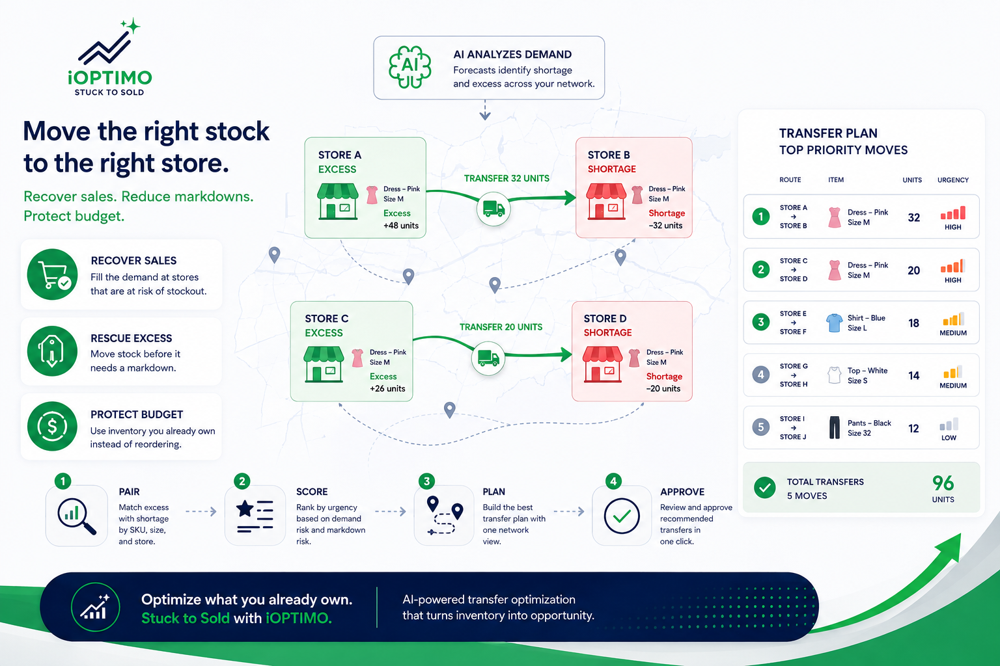

**
Inter-store stock transfer optimization is the practice of rebalancing inventory you already own: moving units from stores where they sit idle to stores where they would sell this week. For multi-store retailers it is usually the fastest inventory win available, because it recovers sales and protects margin without spending a single dollar of new purchase budget.

{/* truncate */}

## Why transfers beat reorders

When a store runs short on a selling item, the reflex is to reorder. But a reorder takes supplier lead time, ties up new budget, and often lands after the demand moment has passed. Meanwhile the exact units the store needs are frequently sitting in another store in the same network — already bought, already paid for, quietly aging toward a markdown.

Rebalancing that stock does three things at once:

- Recovers the sale** at the store that had the demand.

- **Rescues the excess** at the store that did not, before it needs a discount.

- **Protects purchase budget** for genuinely new demand instead of duplicating stock the network already owns.

## Signs your network needs transfer optimization

- **Broken size runs** — a store sells out of core sizes while other stores hold full curves of the same item.

- **Simultaneous shortage and excess** — the same SKU is at stockout risk in one location and overstocked in another.

- **Markdown concentration** — end-of-season discounts cluster in a few stores, which means allocation (not the product) was the problem.

- **Spreadsheet transfer planning** — transfers happen only when a planner has time to build the file, not when the demand signal appears.

## How optimized transfer planning works

Manual transfer planning fails not because planners lack skill but because the decision space is huge: every SKU × size × source store × destination store combination. Optimization tackles it in four steps:

1. **Pair excess with shortage.** Demand forecasts at store and SKU level identify which locations will run short and which hold more than they can sell.

2. **Score by urgency.** Not all transfers matter equally — units closest to a lost sale or a markdown move to the top of the queue.

3. **Build the route plan.** Source, destination, and quantities are laid out on one network view, so logistics cost and effort stay visible.

4. **Approve in one click.** Planners review a pre-ranked recommendation list and act on dozens of moves in minutes.

## Doing this with AI

This is one of the core jobs of [iOPTIMO](https://kb.integratedretail.com/docs/product-documentation/ioptimo-platform), Integrated Retail’s AI inventory and transfer optimization platform: it forecasts demand by store, product, size and color, flags shortage and excess with urgency scores, and generates transfer plans that arrive pre-ranked by priority. It sits on top of the POS and inventory systems retailers already run, such as [Retail Pro Prism](https://kb.integratedretail.com/docs/product-documentation/retail-pro-prism-platform) and [Cegid](https://kb.integratedretail.com/docs/product-documentation/cegid-retail-platform).

For the bigger picture of what AI changes across the whole planning cycle — forecasting, risk detection, and recommendations — start with our guide to [AI-powered inventory optimization for retail](https://kb.integratedretail.com/blog/ai-powered-inventory-optimization-for-retail).

Want to see what a transfer plan looks like on your own network? [Talk to our team](mailto:connect@integratedretail.com) for a 30-minute walkthrough with your stores, your products, your numbers.
