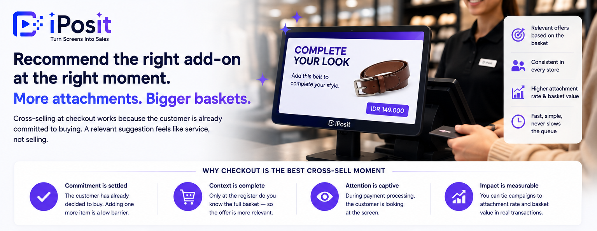

**
Cross-selling at checkout is the practice of recommending a relevant add-on at the moment a customer is already committed to buying — and it works because the hardest part of the sale is finished. The basket is open, the wallet is out, and a well-chosen suggestion feels like service, not selling.

{/* truncate */}

## Why checkout is the best cross-sell moment in the store

- Commitment is settled.** The customer has already decided to buy; adding one small item is a much lower barrier than the original purchase decision.

- **Context is complete.** Only at the register do you know the full basket — which makes the recommendation dramatically more relevant than any mid-aisle promotion.

- **Attention is captive.** During payment processing the customer is looking at the counter. That dwell time is either wasted or working.

## Why most stores still do it badly

The classic approach is the cashier prompt (“would you like socks with that?”) backed by counter merchandising. Both have real limits: staff prompts are inconsistent and disappear under queue pressure, and a static counter display shows the same items to every customer regardless of what they are buying.

## What good checkout cross-selling looks like

1. **React to the basket.** The recommendation should fit what is being scanned — care products with leather shoes, a matching accessory with a dress — using the product and transaction context the POS already has.

2. **Keep it to one clear offer.** A screen crowded with six promotions converts worse than one relevant suggestion with a strong visual.

3. **Use bundles and seasonal moments.** “Complete the set” and time-boxed seasonal offers consistently outperform generic discounts.

4. **Never slow the queue.** The offer must resolve in seconds — a barcode the cashier scans, a yes/no from the customer — or peak-hour operations will kill the program.

5. **Measure attachment rate and basket value.** If you cannot see which campaigns moved those two numbers, you are running decoration, not cross-sell.

## Automating it on the customer display

A customer-facing screen at the register does the prompting for you — consistently, in every store, on every transaction. [iPosit](https://kb.integratedretail.com/docs/product-documentation/iposit-platform) runs real-time cross-sell campaigns on checkout displays, reacting to POS context, with store-level scheduling and campaign analytics, on top of platforms like [Cegid](https://kb.integratedretail.com/docs/product-documentation/cegid-retail-platform) and [Retail Pro Prism](https://kb.integratedretail.com/docs/product-documentation/retail-pro-prism-platform).

For the strategic picture of treating your stores as a media channel, start with [in-store retail media](https://kb.integratedretail.com/blog/in-store-retail-media); for the hardware side, see [customer-facing displays in retail](https://kb.integratedretail.com/blog/customer-facing-displays-in-retail).

[Book a demo](mailto:connect@integratedretail.com) to see checkout cross-sell running on your own product data.
