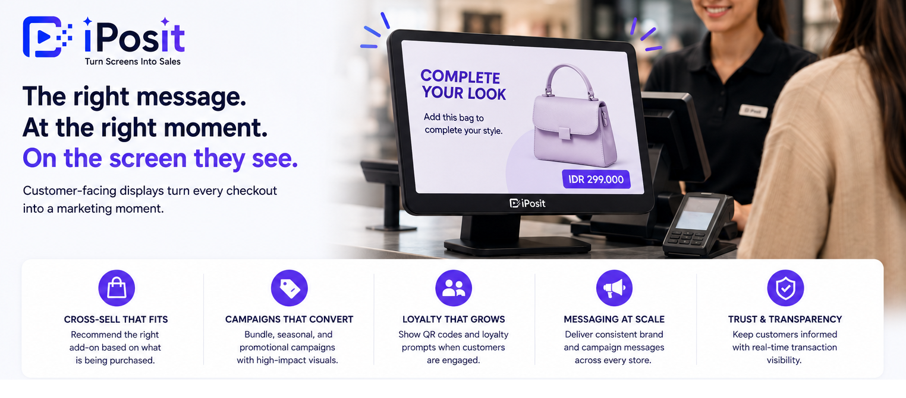

**A customer-facing display is the second screen at the point of sale — the one turned toward the shopper. Traditionally it just mirrored the receipt: items, prices, total. Modern retail treats it as something much more valuable: a guaranteed-attention marketing surface that reaches every single customer at the moment of purchase.

{/* truncate */}

## From receipt mirror to media surface

The display earns its place at the counter through transaction transparency — customers trust a register where they can watch items and prices appear. But between scans, during payment processing, and in idle moments, that same screen can carry:

- Cross-sell recommendations** that react to what is being purchased.

- **Bundle and seasonal campaigns** with modern, high-impact visuals.

- **Loyalty prompts** — sign-up QR codes shown exactly when the customer is engaged with the transaction.

- **Brand and campaign messaging** consistent across every store in the network.

## The hardware question

Most modern POS terminals support a second display natively — dual-display configurations are now standard retail hardware (see our note on [modern POS hardware and dual displays](https://kb.integratedretail.com/docs/kb/cegid/modern-pos-hardware-dual-display)). If your registers already have a customer screen showing only the transaction, the hardware investment is already made; what is missing is the software layer that puts content on it.

## The software layer: what to look for

1. **POS integration, not a parallel system.** The display should consume product and transaction context from the POS you already run, so campaigns can react at checkout in real time.

2. **Central campaign control.** Marketing should push a campaign to a store group in seconds — not file a ticket for someone to update each terminal.

3. **Store-level targeting.** Campaigns scheduled by store group, time window, and promotion objective, so local relevance survives central control.

4. **Retail-grade reliability.** The screen is part of the checkout; it must stay stable through daily store operations with real-time sync.

5. **Analytics.** Impressions matter less than what campaigns did to attachment rate and basket value.

## Putting it together

[iPosit](https://kb.integratedretail.com/docs/product-documentation/iposit-platform), Integrated Retail’s in-store customer display platform, is that software layer: instant campaign activation on customer-facing screens, store-level control, and campaign analytics, working with POS platforms like [Cegid](https://kb.integratedretail.com/docs/product-documentation/cegid-retail-platform) and [Retail Pro Prism](https://kb.integratedretail.com/docs/product-documentation/retail-pro-prism-platform). Most teams launch their first store in under a week.

For the strategy behind the screen, read [in-store retail media](https://kb.integratedretail.com/blog/in-store-retail-media) and [cross-selling at checkout](https://kb.integratedretail.com/blog/cross-selling-at-checkout).

[Book a demo](mailto:connect@integratedretail.com) to see it live on your own store setup.
