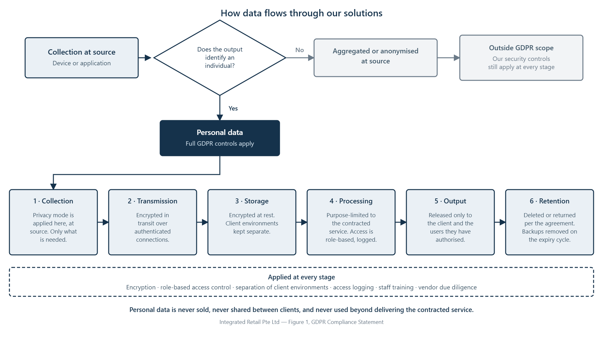

GDPR Compliance Statement

Last update: 27 August 2026

 

 

## 1. Purpose of This Statement

Integrated Retail Pte Ltd ("Integrated Retail", "we", "us", "our") supplies, implements, hosts and supports retail technology solutions — including retail management and point-of-sale software, analytics platforms, in-store sensors and related hardware.

Our clients frequently ask how our solutions sit alongside their own data protection obligations, particularly the EU General Data Protection Regulation (GDPR) and the UK GDPR. This statement is written for those clients and their IT, legal and compliance teams. It explains:

- what the GDPR is, and when it applies to us and to the solutions we deliver;

- the roles we take when personal data is involved;

- how data flows through our solutions, and what we do and do not do with it;

- the privacy controls available in the devices we deploy;

- how we align our practices with GDPR principles across all our solutions, not just any one product;

- what we ask of our clients in return.

This statement is for information only. It is not legal advice, and it does not vary the terms of any contract between us and a client.

** **

## 2. What the GDPR Is, and When It Applies

### 2.1 What the GDPR is

The General Data Protection Regulation (EU) 2016/679 is European Union law governing the protection of personal data. It came into force in May 2018 and is mirrored in the United Kingdom by the UK GDPR.

Its central idea is straightforward: personal data belongs to the individual, not to the organisation holding it. An organisation may process personal data only where it has a proper basis for doing so, only for the purpose it was collected, only for as long as it is needed, and only with appropriate protection in place. Individuals have enforceable rights over their data, and organisations must be able to demonstrate — not merely assert — that they comply.

The GDPR applies to an organisation regardless of where that organisation is located, if it:

- offers goods or services to individuals in the EU or EEA; or

- monitors the behaviour of individuals in the EU or EEA; or

- processes personal data on behalf of a client who is itself subject to the GDPR.

### 2.2 Our position

Integrated Retail is headquartered in Singapore and operates principally in Singapore, Malaysia, Thailand and Indonesia. In most engagements, our processing is governed by the data protection laws of those countries rather than by the GDPR.

However, the GDPR may still be relevant where:

- a client is an EU or UK organisation, or part of a group headquartered there;

- a client's global data protection framework applies GDPR standards to all its markets, including Asia;

- personal data originating in the EU or UK is transferred into a system we operate;

- a solution is deployed at a site in the EU or UK.

We do not market or offer our services to individuals in the EU or UK, and we do not target those markets. Our clients are businesses in Southeast Asia. This statement is published so that clients and their compliance teams can understand our position, not as an offer of services to EU or UK individuals.

Where the GDPR does apply to a client's processing, we support that client's compliance and will enter into a written Data Processing Agreement reflecting the requirements of Article 28. Where it does not apply, we still hold ourselves to the standards described in this statement, because they represent good practice and align closely with the requirements of the Singapore, Malaysian, Thai and Indonesian data protection regimes.

### 2.3 The laws that primarily govern us

Jurisdiction

Principal law

Regulator

Singapore

Personal Data Protection Act (PDPA)

Personal Data Protection Commission (PDPC)

Malaysia

Personal Data Protection Act (PDPA), as amended

Personal Data Protection Department (JPDP)

Thailand

Personal Data Protection Act (PDPA)

Office of the Personal Data Protection Committee (PDPC)

Indonesia

Personal Data Protection Law (UU PDP)

Relevant supervisory authority

These four regimes share most of their core concepts with the GDPR — lawful basis, notification, data subject rights, security obligations, breach reporting and cross-border transfer controls — which is why a single set of internal practices can serve all of them.

 

 

## 3. Three Types of Data — and Why the Distinction Matters

The GDPR treats data differently depending on how identifiable it is. Understanding this is central to assessing any retail technology solution.

Type

What it means

Does the GDPR apply?

Personal data

Information relating to an identified or identifiable person — a name, email address, ID number, location data or online identifier.

Yes

Pseudonymised data

Personal data that can no longer be attributed to a specific person without additional information, which is kept separately and securely.

Yes — pseudonymised data is still personal data

Anonymised data

Information that does not relate to an identifiable person, or that has been rendered anonymous such that the individual is no longer identifiable.

No — Recital 26 states the principles of data protection do not apply to anonymous information

Anonymisation does not have to be entirely risk-free. The recognised standard is that the risk of re-identification must be reduced until it is remote.

In practice, our portfolio spans all three categories. A footfall sensor configured for aggregate counting may produce only anonymous data. A point-of-sale or loyalty platform, by contrast, holds clearly identifiable customer records. We therefore assess each solution on its own facts, and on how it has been configured for a particular client, rather than making a single blanket claim across our portfolio.

** **

## 4. Our Role: Controller or Processor

 

When it applies

Examples

Controller

When we decide why and how personal data is used.

Our own client and prospect contacts, supplier records, job applicants, website visitors.

Processor

When we handle personal data on a client's documented instructions.

Customer, loyalty, transaction or staff records held in a system we implement, host or support for a client.

Sub-processor

Where a client contracts a third party who engages us.

Delivery of services through a partner or system integrator.

When we act as a processor, the client is the controller. That means the client determines the purposes of processing, establishes the lawful basis, provides notices to individuals, and is the first point of contact for data subject requests. We support the client in meeting those obligations but do not assume them.

** **

## 5. How We Use Data — and What We Never Do

We use personal data for one reason: to deliver, support, secure and improve the service a client has contracted us to provide. That covers implementation and configuration, hosting and licensing, maintenance and technical support, fault diagnosis, accuracy tuning, security monitoring, and the reporting and analytics the client has asked for.

Everything outside that purpose is off limits. Specifically:

- We do not sell personal data. Not to advertisers, not to data brokers, not to analytics companies, not to anyone, in any market. We have no revenue model that involves the onward sale of data.

- We do not share data between clients. Each client's environment and data are kept separate. One client's data is never made available to another, in raw or aggregated form.

- We do not use client data for our own commercial purposes. It is not used to build products, generate market reports, or inform our own sales activity.

- We do not use client data to train artificial intelligence models, our own or a third party's, without the client's written instruction.

- We do not enrich, append or combine client data with data obtained from other sources.

- We do not profile or track named individuals. Our analytics solutions are configured to produce aggregate measures, not individual histories.

Where we pass data to a technology vendor, cloud provider or in-country service partner, it is only to the extent needed to deliver, license or support the service, and the recipient is bound by contractual confidentiality and data protection obligations. They act on our instructions or the client's, never for their own purposes.

** **

## 6. How Data Flows Through Our Solutions

The diagram below shows the path data takes through a typical deployment, and where the controls sit. The first decision — whether the output identifies an individual — determines everything that follows.

Figure 1 — Data processing flow

In stages:

Stage

What happens

Control applied

GDPR principle

1. Collection

Data is captured at the device or entered into the application.

The privacy mode is applied here, at source — see section 7. Only the data needed for the purpose is collected.

Data minimisation; privacy by design

2. Transmission

Data travels from the site to the hosting platform.

Encrypted in transit over authenticated connections.

Integrity and confidentiality

3. Storage

Data is written to the platform.

Encrypted at rest where the platform supports it. Client environments are logically separated. Classified and recorded in the data inventory.

Integrity and confidentiality

4. Processing

Data is aggregated, analysed and turned into reports.

Purpose-limited to the contracted service. Access is role-based and logged.

Purpose limitation; lawfulness

5. Access and output

Reports and records are made available.

Released only to the client and the users they have authorised. Never to another client, never sold.

Purpose limitation

6. Retention and deletion

Data reaches the end of its retention period, or the contract ends.

Deleted or returned per the agreement; backup copies removed on the normal expiry cycle.

Storage limitation

Where the decision at stage 1 is that the output does not identify an individual — for example, a sensor configured to produce aggregate counts only — the data falls outside the scope of the GDPR. We nonetheless apply the same security controls at every stage, because our obligations to the client under the service agreement do not depend on how the data is classified.

** **

## 7. Privacy Controls in Deployed Solutions

### 7.1 Privacy mode selection

Sensor-based solutions are not all-or-nothing. The devices we deploy typically offer a range of selectable operating modes, and the mode chosen determines whether personal data is created at all.

The modes commonly available, from most to least privacy-preserving:

Mode

What the device processes

What is retained

Depth or silhouette only

Counting is performed from 3D depth data or silhouettes. No video image is used for the counting function.

Aggregate counts only. No image ever leaves the device.

Privacy masking

Individuals are detected and masked or blurred in real time, at the video stream, before any footage is processed or stored.

Analytics output plus masked footage in which individuals are not identifiable.

Low-resolution verification samples

Short samples are recorded at a resolution too low to identify a person, solely to audit counting accuracy.

Brief retention, then automatic deletion.

Full-resolution video

Standard video capture.

Retained per the client's own configuration.

Our default is the most privacy-preserving mode that meets the client's stated objective. In most footfall and occupancy deployments, that is depth or silhouette counting, which produces no personal data at all.

Any change to a less privacy-preserving mode requires the client's written instruction, and we will ask the client to confirm that it has a lawful basis and appropriate notices in place for the mode selected. Full-resolution video is enabled only where the client operates it under its own CCTV or security arrangements, with its own signage and lawful basis.

The mode selected is recorded in the deployment record for each site, so that both parties have a written record of how the system is configured. Clients may ask us to review or change the mode at any time.

The specific modes available vary by vendor and device model, and the manufacturer's own privacy documentation governs the technical detail. We provide that documentation on request.

### 7.2 Device identifier hashing

Some analytics solutions detect nearby devices — for example, from Wi-Fi probe requests — to estimate visit patterns or returning-visitor rates. Where this feature is used, the raw identifier is never stored.

How it works. A device identifier such as a MAC address is a hardware value tied to a device, not to a named person. On detection, the identifier is passed through a one-way key derivation function together with a secret salt value, and repeated over many iterations. The commonly implemented algorithm is PBKDF2 with HMAC-SHA256. The output is a fixed-length value that cannot be reversed to recover the original identifier — not by the client, not by us, and not by the vendor. Only that value is transmitted and stored.

Why the salt matters. Without a salt, an attacker could pre-compute the hash of every possible identifier and match the results. The salt makes those pre-computed tables useless, and the iteration count makes brute-force matching computationally impractical.

How we treat the result. Where hashing is applied to a single visit and the value is discarded shortly afterwards, the result is anonymous data. Where the value persists so that returning visits can be recognised, it functions as a persistent identifier — and we take the cautious position of treating it as pseudonymised personal data, applying full GDPR-standard controls, rather than claiming it falls outside scope. We would rather over-protect than rely on an exemption a regulator might not accept.

This feature is enabled only where a client has asked for it and has a lawful basis for it. It is off by default. The specific algorithm, iteration count and salt handling vary by vendor and model, and the manufacturer's documentation governs; we provide it on request.

** **

## 8. How We Apply the GDPR Principles

The following applies across our solutions and services.

### 8.1 Lawfulness, fairness and transparency

We process personal data only where there is a proper basis for doing so — a contract, a legal obligation, a legitimate interest, or consent. As a processor, we act only on our client's documented instructions and will tell the client if an instruction appears to conflict with applicable law.

### 8.2 Purpose limitation

As set out in section 5, we use client data only to deliver, support, secure and improve the contracted service.

### 8.3 Data minimisation

We configure solutions to collect the least data needed for the intended outcome. Where a business objective can be met with aggregated or anonymised data, we deploy the solution that way by default. Where a solution offers optional data-collecting features, we enable them only where the client has a clear purpose and instructs us to.

### 8.4 Accuracy

We provide the tools for clients to correct and update records held in their systems, and we correct data we hold as controller when we are notified that it is wrong.

### 8.5 Storage limitation

Retention periods are set in the applicable service agreement or as instructed by the client. Where a platform supports configurable retention, we help clients set periods that match their own policies. At the end of a contract, we delete or return client data in line with the agreement. Residual copies held in backup media are removed on the normal backup expiry cycle rather than immediately, and remain protected by the same controls until they are.

### 8.6 Integrity and confidentiality

See section 10.

### 8.7 Accountability

We maintain records of the processing we carry out on behalf of clients, keep our vendor and subprocessor documentation current, and make it available to clients on request.

** **

## 9. Privacy by Design and by Default

We build privacy considerations into how solutions are scoped and deployed, rather than adding them afterwards:

- Design-stage assessment. During scoping we identify what personal data a solution will touch, and whether the objective can be achieved with less.

- Anonymisation at source, where the technology supports it. For analytics and sensor solutions, we prefer configurations that generate aggregated counts and metrics rather than individual-level records. Where a device produces a hardware identifier, we favour solutions that convert it into an irreversible hashed value on the device itself — see section 7.2.

- Restrictive defaults. Optional features that increase data collection are switched off unless the client requires them, and the most privacy-preserving device mode is selected by default — see section 7.1.

- Role-based access. Access rights are scoped to the minimum needed for each role, on both our side and the client's.

- Separation. Client environments and data are kept logically separate. One client's data is never made available to another.**
**

## 10. Security Measures

We maintain organisational, technical and physical safeguards proportionate to the sensitivity of the data, including:

- access control on a "need to know" and "least privilege" basis;

- irreversible hashing of passwords and, where applicable, device identifiers;

- encryption of data in transit, and at rest where the platform supports it;

- authenticated, logged and time-limited remote support access;

- access and activity logging, reviewed periodically;

- confidentiality obligations and data protection training for our staff;

- security and privacy due diligence on the vendors and subprocessors we engage;

- documented business continuity and disaster recovery arrangements, including encrypted daily backups, off-site and immutable copies, and periodic restoration testing;

- periodic review of our controls and processing activities.

Our Information Security Policy sets these out in full.

** **

## 11. Data Subject Rights

Under the GDPR, individuals have the right to access, rectify, erase, restrict, object to, and port their personal data, and to complain to a supervisory authority.

- Where we are the controller, individuals may exercise these rights with us directly using the contact details in section 16. We respond within one month, or explain why we need longer.

- Where we are the processor, requests should be directed to the client who controls the data. If an individual approaches us, we will refer them to the client and will not respond substantively without the client's instruction. We provide reasonable assistance — including technical means to locate, export, correct or delete records — so the client can meet its own deadlines.

** **

## 12. International Transfers

Delivering services across Southeast Asia means personal data may be transferred to, stored in, or accessed from countries outside the one where it was collected — including Singapore, Malaysia, Thailand, Indonesia, and the locations of our cloud providers and technology vendors.

In the rare case that personal data subject to the GDPR would be transferred outside the EEA or UK in connection with our services, we will put in place an appropriate transfer mechanism before the transfer takes place — such as the European Commission's Standard Contractual Clauses or the UK International Data Transfer Agreement / Addendum, together with any supplementary measures the circumstances require. A current list of the locations and subprocessors relevant to a given service is available to clients on request.

** **

## 13. Personal Data Breaches

We maintain an incident response process covering detection, containment, assessment, notification and remediation.

Where we act as a processor, we notify the affected client without undue delay after becoming aware of a personal data breach, with the information the client needs to assess the incident and meet its own notification obligations — including, under the GDPR, notifying its supervisory authority within 72 hours where required.

Where we act as a controller, we notify the relevant authority and affected individuals as required by the applicable law.

** **

## 14. Data Protection Impact Assessments (DPIAs)

A DPIA is required where processing is likely to result in a high risk to individuals — for example, large-scale systematic monitoring of a publicly accessible area, large-scale processing of special category data, or profiling with significant effects.

The obligation to carry out a DPIA sits with the controller — usually our client. Our position is:

- For solutions configured to process only anonymised or aggregated data, a DPIA is generally not triggered by the solution itself, because the GDPR does not apply to anonymous information.

- For solutions that process identifiable customer or employee data — such as loyalty, CRM, POS or workforce systems — a DPIA may well be appropriate, and we recommend clients assess this before deployment.

- Where a client selects a less privacy-preserving device mode under section 7.1, or enables device identifier detection under section 7.2, we recommend the client reassess whether a DPIA is required.

- We provide the technical information clients need to complete a DPIA: what data a solution collects, where it is stored, how long it is kept, who can access it, and what safeguards apply.

We reassess this position when a solution's scope, technology or configuration changes.

** **

## 15. What We Ask of Our Clients

GDPR compliance for a deployed solution is a shared responsibility. As controller, our clients are responsible for:

- establishing a lawful basis for the processing carried out in their systems;

- providing privacy notices to their customers and employees, including in-store signage where sensors or cameras are in use;

- confirming the device privacy mode that matches their lawful basis, and instructing us in writing before any change to a less privacy-preserving mode;

- configuring retention settings and user access rights appropriately for their business;

- carrying out access reviews — we recommend at least annually — and promptly removing accounts that are no longer needed;

- carrying out a DPIA where one is required;

- responding to data subject requests relating to their data, with our support;

- instructing us in writing where processing beyond the agreed scope is required.

We do not create, modify or delete client data without the client's instruction.

** **

## 16. Governance, Review and Contact

This statement is owned by our Data Protection Officer, who is responsible for its accuracy and for reviewing it periodically and whenever there is a material change to our services or to applicable law. The current version is always published on our website.

Data Protection Officer Integrated Retail Pte Ltd Email: connect@integratedretail.com

For questions about how a specific solution handles personal data, or to request a Data Processing Agreement, subprocessor list or vendor privacy documentation, please contact us using the details above.

 
