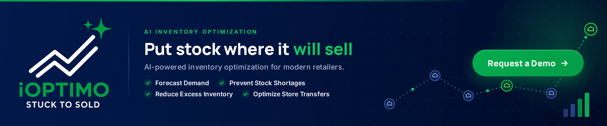

# iOPTIMO: AI-Powered Inventory Optimization for Modern Retailers

iOPTIMO is **Integrated Retail's proprietary AI inventory and transfer optimization platform**, developed in-house alongside our retail technology ecosystem, including Cegid, Retail Pro Prism, and FootfallCam.

Designed specifically for multi-store retail operations, iOPTIMO helps retailers forecast demand, identify shortage risks, uncover excess inventory, and determine exactly which products should move between stores. The result is fewer stockouts, reduced markdowns, and improved inventory productivity across the entire retail network.

## Why Retailers Choose iOPTIMO

### Demand Forecasting by Store, Size, and Color

Forecast expected sell-through performance by store, product, size, and color before inventory issues impact sales.

iOPTIMO automatically adapts forecasting models based on SKU and store behavior. Seasonal products, intermittent sellers, and fast-moving trends each receive the most appropriate forecasting algorithm without requiring manual configuration.

- Store-level demand forecasting

- SKU, size, and color forecasting

- Automatic model selection

- Improved replenishment planning accuracy

- Early identification of stockout risks

### AI-Driven Transfer Planning

Move inventory where it is needed most.

iOPTIMO identifies stores with excess inventory, stores facing shortages, and recommends the optimal transfer quantities between locations. Recommendations are automatically prioritized, allowing planners to review and execute dozens of transfer opportunities in minutes rather than hours.

- Automatic source and destination selection

- Priority-ranked transfer recommendations

- Network-wide inventory balancing

- Visual transfer mapping across stores

- Reduced markdowns and missed sales opportunities

### Advanced Inventory Analytics

Gain complete visibility into inventory health across your retail network.

Monitor stock cover, slow-moving products, broken size runs, excess inventory, and replenishment pressure from a single dashboard.

Urgency scoring highlights the items most likely to experience stockouts, helping planners focus on actions that drive immediate business impact.

- Stock cover analysis

- Excess inventory identification

- Slow-moving stock detection

- Broken size run analysis

- Replenishment pressure monitoring

- Urgency-based prioritization

### Integrated AI Assistant

Ask questions in plain language and receive actionable insights instantly.

The built-in AI Assistant helps teams investigate inventory shortages, excess stock, sales trends, transfer recommendations, and forecast results without needing to navigate multiple reports.

- Natural language queries

- Inventory and sales analysis

- Transfer recommendation explanations

- Forecast interpretation

- Faster decision making for planners and managers

## How iOPTIMO Works

### 1. Connect Retail Data

Integrate sales transactions, inventory records, product master data, and store information from your existing retail systems.

### 2. Forecast Demand

Generate SKU-level demand forecasts across stores using AI-powered forecasting models.

### 3. Detect Inventory Risks

Identify shortages, excess inventory, broken assortments, unusual demand patterns, and replenishment risks.

### 4. Take Action

Review AI-generated transfer recommendations, prioritize actions, and measure expected business impact before execution.

Unlike traditional inventory planning solutions, **iOPTIMO works alongside your existing ERP and POS platforms** rather than replacing them. Once the required data is connected, teams can access forecasts, transfer recommendations, inventory analytics, and AI-driven insights from a single workspace.

## Built from 20 Years of Retail Experience

iOPTIMO is developed by **Integrated Retail**, leveraging more than two decades of hands-on retail consulting experience across Asia Pacific.

Every feature has been designed to solve real-world inventory planning challenges encountered by our consultants while supporting:

- 250+ active retail clients

- 4,000+ retail touchpoints managed daily

- Multi-brand and multi-store retail operations

- Fashion, footwear, specialty retail, and lifestyle sectors

The result is software built around proven retail best practices—not theoretical supply chain models.

## Benefits of iOPTIMO

- Reduce stockouts before they impact sales

- Lower excess inventory and markdown exposure

- Improve inventory productivity across stores

- Optimize inter-store transfers using AI

- Increase full-price sell-through

- Provide planners with clear, prioritized actions

- Enable faster inventory decisions with AI assistance

## See iOPTIMO with Your Own Data

Experience how AI-powered inventory optimization can improve retail performance across your store network.

Schedule a personalized 30-minute walkthrough using your stores, your products, and your business metrics. No setup is required.

### Book an iOPTIMO Demo

Discover how AI forecasting, transfer optimization, and inventory analytics can help your retail business reduce stockouts and maximize sales.

[ Contact Integrated Retail ](https://integratedretail.com/contact/)
