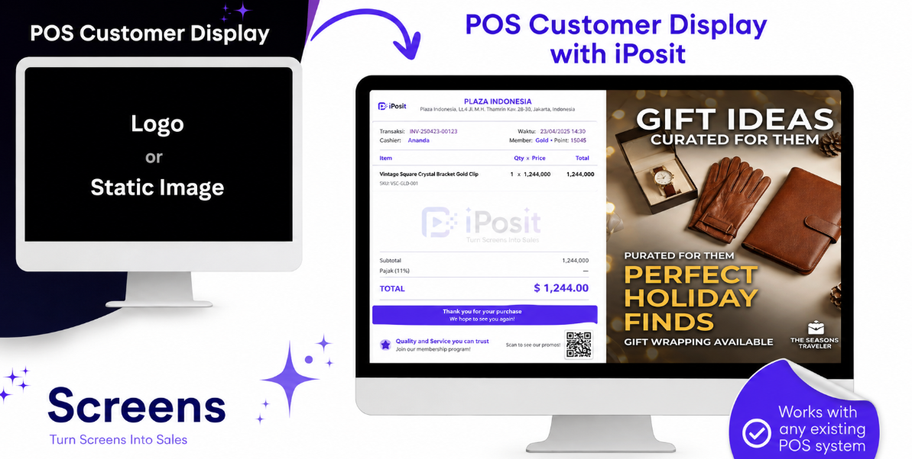

```html

# iPosit Customer Display Platform for Retail | Real-Time In-Store Promotions & POS Campaign Management


Transform every checkout into a revenue opportunity with real-time customer display campaigns, cross-sell recommendations, and centralized retail promotion management.

**iPosit** is Integrated Retail's in-store customer display platform — built in-house alongside iOPTIMO and integrated with leading retail platforms including Cegid and Retail Pro Prism.

Designed for modern retailers, iPosit transforms every checkout interaction into a powerful marketing opportunity by displaying targeted promotions, product recommendations, loyalty messaging, and campaign content directly on customer-facing screens.

Instead of relying on static posters and printed promotional materials, retailers can instantly launch dynamic campaigns across multiple stores, ensuring every customer sees the right message at the most influential moment of the purchasing journey.

## Why Retailers Choose iPosit

### ⚡ Instant Campaign Activation

Launch in-store campaigns in seconds and distribute them directly to customer-facing displays without requiring store visits or manual terminal configuration.

Replace traditional promotional posters with dynamic campaigns that can be updated, scheduled, and measured in real time.

### 🛒 Extension of Your POS Platform

iPosit integrates seamlessly with existing retail POS environments, including Cegid and Retail Pro Prism.

By consuming product and transaction context directly from checkout activities, campaigns can react instantly to customer purchases and display relevant offers, recommendations, and promotional messages.

The result is a smarter checkout experience that helps increase basket value and improve customer engagement.

### 🏪 Store-Level Campaign Control

Manage campaigns centrally while maintaining flexibility at the store level.

Schedule promotions by store group, region, date range, time window, or business objective to ensure campaigns remain relevant for each location.

Maintain a consistent brand experience across the retail network while allowing local teams to execute targeted initiatives when required.

### 🔒 Retail-Grade Reliability

Built specifically for demanding retail environments, iPosit provides reliable synchronization across checkout locations and customer-facing displays.

Deliver impactful promotional experiences for:

- Cross-sell recommendations

- Upsell opportunities

- Bundle promotions

- Seasonal campaigns

- New product launches

- Loyalty program awareness

### 📊 Campaign Analytics

Understand how campaigns influence customer behavior through measurable performance insights rather than assumptions.

Monitor campaign effectiveness using metrics such as:

- Basket value growth

- Cross-sell performance

- Promotion engagement

- Store-level results

- Customer purchasing trends

Make better marketing decisions based on real retail data.

## Designed for Modern Retail Operations

Today's retailers require more than digital signage. They need a connected platform that bridges marketing, store operations, and customer engagement.

iPosit empowers marketing teams to launch campaigns instantly, gives operations teams centralized control, and enables brands to communicate directly with customers at the point of purchase.

### Key Benefits

- Increase cross-sell and upsell opportunities

- Improve average basket value

- Deliver consistent messaging across stores

- Reduce dependence on printed promotional materials

- Accelerate campaign deployment and updates

- Provide measurable campaign performance insights

- Support multi-store retail operations

- Strengthen customer engagement at checkout

## Popular Retail Use Cases

### Cross-Sell Promotions

Recommend complementary products during checkout to increase basket value and improve conversion rates.

### Seasonal Campaigns

Promote festive collections, seasonal offers, and limited-time campaigns across all stores simultaneously.

### Brand Partnerships

Provide supplier-funded promotional space and highlight featured products at the point of purchase.

### Loyalty Program Awareness

Encourage customer enrollment and increase participation in loyalty programs through targeted checkout messaging.

## Frequently Asked Questions

### How quickly can we go live?

Most retailers launch their first store within one week, including campaign setup, display validation, and operational readiness checks.

### Does iPosit work with existing POS data?

Yes. iPosit is designed to consume product and transaction context directly from POS systems, enabling campaigns to react dynamically during checkout.

### Can we control campaigns per store?

Absolutely. Campaigns can be scheduled and localized by store group, region, date range, time window, and promotion objective.

### Is support included?

Yes. All plans include onboarding support. Growth and Enterprise plans include faster response times and campaign optimization guidance.

## Get Started with iPosit

Discover how iPosit can enhance your checkout experience and help your retail business increase customer engagement, campaign effectiveness, and sales performance.

Our team will schedule a personalized demonstration based on your store setup, POS environment, and campaign objectives.

Available across **Singapore, Indonesia, Thailand, and India.**

🌐 **Visit the iPosit Site****[ cdpr.integratedretail.com ](https://cdpr.integratedretail.com)

💬 Book a Demo**
[ connect@integratedretail.com ](mailto:connect@integratedretail.com)

```
